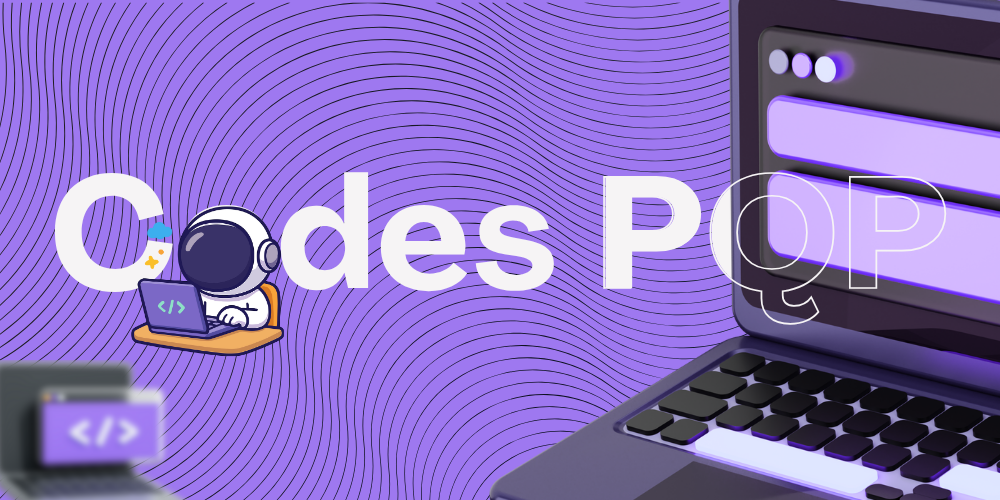

<div align="center">

  

  # Codes Pqp
  ### Programa Qualitativo Perfeito

  **A linguagem de programação brasileira: acessível, divertida e didática.**

  [](https://www.java.com)
  [](LICENSE)
  []()

</div>

---

## ✨ Sobre o Projeto

**Codes Pqp** (Programa Qualitativo Perfeito) nasceu da ideia de desmistificar a programação. Criada para unir simplicidade e identidade nacional, nossa sintaxe é baseada inteiramente no **português**, utilizando comandos intuitivos e mensagens amigáveis.

É a ferramenta ideal tanto para quem está dando os primeiros passos na lógica de programação quanto para quem quer se divertir codando com o "jeitinho brasileiro".

---

## 🧰 Sintaxe e Comandos

Aqui está o guia rápido para você começar a codar agora mesmo:

| Categoria | Comando / Sintaxe | Descrição |
| :--- | :--- | :--- |
| **Variáveis** | `VAR x = 10;` | Declaração com inicialização opcional. |
| **Saída** | `ESCREVEAI "Olá";` | Imprime uma mensagem ou valor na tela. |
| **Entrada** | `LEAI variavel;` | Lê um dado do usuário e salva na variável. |
| **Condicional** | `SE (cond) { } SENAO { }` | Estrutura clássica de IF/ELSE. |
| **Loops** | `VOLTAINFINITA (cond) { }` | Laço de repetição (While). Use `PAREI;` para sair. |
| **Funções** | `FUNCAO nome(p) { ... }` | Declaração de funções com escopo local e `RETOR`. |
| **Switch** | `ESCOLHEAI expr { ... }` | Estrutura de seleção com `CASO` e `PADRAO`. |
| **Blocos** | `{ ... }` | Delimitadores de escopo. |

### Tipos de Dados Suportados
* `INTEIRO` (Números inteiros)
* `QUEBRADO` (Ponto flutuante / Float)
* `ISSOAI` / `MENTIRA` (Booleanos: Verdadeiro / Falso)
* `"Texto"` (String)
* `NULO` (Ausência de valor)

---

## 🚀 Exemplo de Código

Veja como é simples resolver problemas com **Codes Pqp**:


<pre> ```// 1. Declaração de variáveis
VAR x = 10;
VAR y = 5;

// 2. Operação aritmética e impressão
VAR soma = x + y;
ESCREVEAI "A soma de X e Y é: " + soma;

// 3. Tomada de decisão
SE (x > y) {
    ESCREVEAI "X manda na parada (é maior)";
} SENAO {
    ESCREVEAI "Y assumiu o controle";
}

// 4. Laço de repetição
VAR i = 0;
ESCREVEAI "Iniciando contagem regressiva...";

VOLTAINFINITA (i < 3) {
    ESCREVEAI "Contador: " + i;
    i = i + 1;
    
    SE (i == 3) {
        ESCREVEAI "Fim da contagem! PAREI.";
        PAREI; // Quebra o loop
    }
}

// 5. Funções
FUNCAO dobro(n) {
    RETOR n * 2;
}

ESCREVEAI "O dobro de Y é: " + dobro(y);
``` <pre>

---

## 📚 Estrutura Técnica

O projeto foi construído seguindo os princípios fundamentais da construção de compiladores:

* 📂 **Lexica (Scanner):** Transforma o código fonte bruto em tokens.
* 📂 **Lexica.Token / TokenType:** Definição da estrutura dos tokens.
* 📂 **Sintatica (Parser):** Analisa a gramática e cria a Árvore de Sintaxe Abstrata (AST).
* 📂 **Semantica (Interpreter):** O coração do projeto. Executa a AST, gerencia memória, variáveis e escopo.

---

## 🏗️ Instalação e Execução

Para rodar o **Codes Pqp** na sua máquina, você precisará do [Java JDK](https://www.oracle.com/java/technologies/downloads/) instalado.

1. **Clone o repositório:**
   git clone https://github.com/cArthurDev/CodesPqp.git
   cd CodesPqp

2. **Compile o projeto:**
   javac -d bin src/**/*.java
   # Ou, se os arquivos estiverem na raiz:
   javac *.java

3. **Execute o interpretador:**
   java Main

4. **Divirta-se:**
   Edite o arquivo `programa.txt` com seus comandos Codes Pqp e veja a mágica acontecer!

---

## 🔮 Roadmap (Adições Futuras)

Estamos sempre evoluindo! Nossos próximos passos incluem:

- [ ] Suporte a **Arrays/Listas** (para guardar a feira toda numa variável só).
- [ ] Estruturas de dados complexas e Objetos.
- [ ] Manipulação de Arquivos (ler e escrever txt).
- [ ] Melhoria na biblioteca padrão.

---

## 🎯 A Filosofia "Pqp"

Para evitar confusões (e manter o bom humor), o acrônimo **Pqp** significa estritamente:
> **P**rograma **Q**ualitativo **P**erfeito

Nossa meta é código limpo, didática clara e aquele orgulho de ser um projeto BR. 🇧🇷

---

## 👨‍💻 Autores e Contribuidores

Este projeto foi desenvolvido com carinho por:

* **[cArthurDev](https://github.com/cArthurDev)**
* **[Maria-Cassis](https://github.com/Maria-Cassis)**
* **[WaisGH](https://github.com/WaisGH)**

*Inspirado nas aulas de Compiladores (2025), provando que dá para aprender rindo.*

---

## 📝 Licença

Este projeto está sob a licença MIT - sinta-se livre para estudar, modificar e distribuir para fins educacionais.

---
<div align="center">
  Feito com ☕ e Java.
</div>
```
